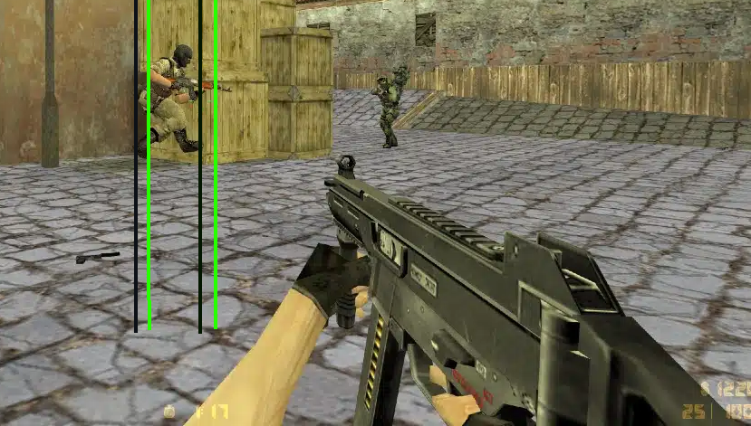

# Networking for an FPS by Jim Hamers - January 2026

### Introduction
This is a blogpost about online FPS games and their netcode to make the game fair and responsive. We will be diving into techniques to make the online experience feel responsive despite the network in between.
To learn about these topics, I've made a basic FPS game in C++ with the networking library ENet and will expand on this topic with some pseudocode from my frame of reference. This blog post expects familiarity with online gaming, specifically with the FPS genre; also, some networking knowledge is helpful but not needed.
Most sections will show pseudo-code at the end to help explain.

### Jargon
- FPS, First Person Shooter, the game genre.
- PoV, Point of View.
- Client, the player's perspective, or machine.
- Server, data broker between clients.
- Packet, information between server/client.
- Latency, delay in milliseconds from server to client one way.
- Jitter, time variance between packet arrivals.
- Frame, one render update on the client's machine.
- Tick, one fixed step for networkside, running both on the server and client.
- Input: The client's intent for one tick, key presses, and mouse movement.

## Table of contents

1. Client-Server architecture
2. Authoritative server
3. Client-side prediction
4. Server reconciliation
5. Poor network condition mitigation
6. Rollback hitscan
7. Conclusion

## 1. Client-Server Architecture
A client is just the machine playing the game; single-player games don't need a server to communicate with. So effectively you're playing on an authoritative client. 
This all works fine until we want to add more players. The players need to communicate with each other; this middleman is called a server. The server is the hub that sends and receives all the data between the clients. The clients don't need any information about the other clients to send or receive data.

```cpp
//What the client sends, server receives
struct ClientPacket
{
    int ID;

    vector3 position;
};

//What the server sends, client receives
struct ServerBroadcast
{
    std::vector<ClientPacket> clientInfos;
};

// Member variables for reference
class Client
{
private:
    int m_ID; // My ID (normally saved by network library)
};

class Server
{
    // Nothing.
};

// This happens every tick (not frame) from here on.
// Every client tick
ClientSendData(ClientPacket);
ClientReceiveData(ServerBroadcast);

// Every server tick
ServerReceiveData(ClientPacket);
ServerBroadcastData(ServerBroadcast);
```

This pseudocode will explain the main differences as we go through the chapters. If a struct definition doesn't change, it'll be omitted for conciseness.

## 2. Authoritative server
An authoritative server will be the brain behind the game. When a client wants to move, it sends their input. The server receives the input and moves the client corresponding to the input. The server broadcasts the new position to all clients. The client receives the data and updates their (and others) location on their machine.


Above there is a GIF from the player's and server's views. Notice that the server's PoV is ahead of the client's.

There are tradeoffs for an authoritative server. Having any meaningful latency will make the client perceive a noticeable delay for their input. Considering the data has to travel both ways. You'll feel the delay twice as much.

### Why do we want an authoritative server?

If a nefarious player were to be playing with a modified client, for example, and modifying their speed, the ground truth will be the same for client and server, because the client isn't doing the movement itself. The server is moving every player.
But it's not only beneficial against cheating; having a ground truth that everyone relies on helps synchronization. If a player would somehow drop packets when they receive the latest packet from the server, they'd be on the same tick as everyone else.

But knowing why doesn't mean it's worth the sacrifice. Surely we can do something about this input delay, and yes, there is, and that's client-side prediction.

```cpp
// Structs
struct Input
{
    bool moveLeft;
    bool moveRight;
    bool shoot;
    vector3 rotation; // Looking direction where the player is aiming
};

struct ClientPacket
{
    int ID;

    //vector3 position; Remove this.
    Input clientInputs;
};

struct ClientInfo
{
    int ID; // same ID as the packet

    vector3 position; // We still broadcast the positions not the inputs
};

struct ServerBroadcast
{
    std::vector<ClientInfo> clientInfos;
};

// Member variables for reference
class Client
{
private:
    int m_ID; // My ID (normally saved by network library)
};

class Server
{
    // Nothing.
};
```

So the key difference here:
- Client sends input instead of position.
- Server handles the movement.
- Server responds with all client locations.
- Client updates their own location from the received server broadcast.

## 3. Client-side prediction

To improve on the authoritative server design, client prediction comes in.
Having any delay on your inputs doesn't play well; it will feel sluggish and detracts from the experience.
To combat this delay, we're going to predict/assume that the server will move us according to our input, so we move prematurely instead of waiting for the server to acknowledge and update our position. Now we've solved the input delay, as long as everything stays "perfectly in sync" (more on that later).


There is some small hitching that happens in the GIF that our code will not have. We're ignoring the server's response for our own position (for now).

```cpp
// Member variables for reference
class Client
{
private:
    int m_ID; // My ID (normally saved by network library)

    UpdatePosition(ClientPacket); // Exactly same as server
};

class Server
{
private:
    UpdatePosition(ClientPacket); // Exactly same as client
};
```

The UpdatePosition function was already happening in the server, but now it's also used on the client.


```cpp
// Client changes

UpdatePosition(ServerBroadcast)
{
    for (auto clientInfo : clientInfos) // Each loop
    {
        // Update our tick from the servers response
        m_lastAcknowledgedInput  = clientInfos.currentTick;

        if (clientInfo.ID == m_ID) // Is it my data?
        { 
            //Skip if its my own data, we've already predicted and moved accordingly
        }
        else
        {
            //Update other clients data.
        }
    }
}

// Precalculate my movement immediately.
ClientPredict(ClientPacket);

// Send my input to the server.
ClientSendData(ClientPacket);
```

This synchronization can drift easily.
- Packet drop (the server never receives a tick from the client)
- Frequency mismatch: both devices run at 60 Hz, but hiccups happen.

Now we finish this puzzle with the final piece. Server reconciliation correcting our prediction when it drifts.

## 4. Server reconciliation

Server reconciliation is more than just updating my position whenever I receive an update from the server. It's also storing all the inputs we've sent to the server in a list with a #tick variable, so we know exactly what inputs the server has received and which haven't. Whenever the client receives an updated version of their position, they can redo all the inputs that haven't been acknowledged, resulting in the exact same position as before.


With the updated reconciliation, the client and server are always 100% the same. This will also work for compounding effects such as gravity. But when collisions happen, it gets muddy... we won't get into that problem.

```cpp
struct ServerBroadcast
{
    int currentTick; // This is new!
    std::vector<ClientPacket> clientInfos;
};

class Client
{
private:
    ...
    int lastAcknowledgedTick; // This is new!

    // Store all inputs that haven't been acknowledged by the server.
    vector<Input> m_sendInputs; // This is new!

    UpdatePosition(ClientPacket);
};

class Server
{
private:
    int currentTick; // This is new!

    UpdatePosition(ClientPacket);
};
```

```cpp
// Order of operations FOR THE CLIENT

//ServerBroadcast data is received and stored.
ClientReceiveData();

//Update everything
UpdatePosition(ServerBroadcast)
{
    // Delete older inputs (reverse indexing for safety)
    for (int i = m_inputs.size() - 1; i >= 0; i--)
    {
        if (m_inputs[i].currentTick <= m_lastAcknowledgedTick)
        {
            m_inputs.erase(m_inputs.begin() + i);
        }
    }

    for (auto clientInfo : clientInfos) // Each loop
    {
        if (clientInfo.ID == m_ID) // is me?
        {
            //Reconciliate position
            m_position = clientInfo.position;

            // Re-apply all inputs
            for (auto input : m_Inputs)
            {
                ClientPredict(input);
            }
        }
        else
        {
            //Update other clients data.
        }
    }
}

// Send my input to the server.
ClientSendData(ClientPacket);
```

All the predictions moved inside of a loop.
After updating my position from the server, we reapply all the inputs we've stored.
Note that this logic will be very similar to what the server does when receiving inputs.

## 5. Poor network condition mitigation

### Latency

In the real world, the latency will fluctuate; some packets arrive sooner than others.
Our prediction was done to mitigate all latency for the players' movement.

Other clients that the player sees walking around will not have this prediction luxury. The only surface-level fix is to have the client be 1 or more ticks behind, and you buffer that difference. But this is not perfect; any client can lag for longer than you buffer. This problem is harder than it seems, perhaps the focus of my next networking-related blog.

### Packet drops

If some packets are dropped, we're missing data. By re-sending every input, the server will always get updated on our location whenever any packet arrives. We need to drop more packets in a row than we buffer; since the inputs are relatively small in data, we can have a buffer of 60 inputs (1 second) for negligible cost.

### Packets in the wrong order

Reject any packet that's older than the newest we've received, since we're already sending every old packet with any newer packet, we're never losing data as long as it fits in our input buffer.

We're already getting rid of the older packets the server has acknowledged, but what if the server's broadcast is out of order?
You just check what tick the broadcast gave you; if it's any older than the newest received, just ignore it.

```cpp
ClientReceiveData(ServerBroadcast);

// Ignore if not newer
if (serverBroadcast.currentTick <= m_lastAcknowledgedTick)
    return; // Early out

// Packet is newer so handle accordingly
...

```

This packet rejection counts the same for both server and client. Since both sides can have their packets out of order, do it for both on the receive side.

## 6. Rollback hitscan

This next part is where the FPS netcode comes into play; before it's just generic inputs that apply to every game. Even though network rollback is applied in many different games, this will be about shooting rollback.


In Counter-Strike, as an example, you're seeing a player and their hitboxes from multiple frames.

Network rollback is for the server to go back in time and review the footage with all the data that the client had at the time.

Knowing we're predicting means we're ahead of the server, but we're also waiting for the server to send updated positions of the enemy team, which means the enemies we see are always a few ticks behind their real position on the server. Shooting at them is shooting at a ghost.

The server needs to store the positions of players for an N amount of ticks.



The black lines represent where the enemy's hitbox is for the player's PoV; the green lines represent where the enemy is for the server's PoV. As you can see, there is a discrepancy. With higher latency, the lines will drift further apart.

Anyone who has played an online shooter has experienced dying when you just ducked behind a wall for cover; it might feel unfair to you, but on the other end, the enemy shot you a couple ticks back where you weren't fully behind cover just yet. So either you don't get hit and the shooter has a bad experience or you try to make the best of it. It's the price we have to pay.

To fix this discrepancy, we roll back to the exact client PoV from a tick in the past.

```cpp
struct ClientPacket
{
    int ID;

    vector<Input> clientInputs;
    int lastAcknowledgedTick; // This is new!
};
```

We're now also sending the last acknowledged tick. My location on a tick will see the players from a previous tick; that's why we send this info as well.
As the server reconstructs the scene, it'll use the current tick from the packet, which also tells the server it shot in that frame. And use the lastAcknowledgedTick from that packet to determine enemy player location.

```cpp
//Short example of rollback:
struct snapshot
{
    vector<clientInfo> clients;
};

class Server
{
    ...
    // Snapshots fixed array of 100 inputs. (add custom logic to make it a circular buffer)
    snapshot m_snapshots[100]; // This is new!
};

// For clarity player = the shooter, enemy = other clients, server = the server.
Rollback(PlayerShootPacket)
{
    const int enemyTick = shootInput.lastAcknowledgedTick;
    const snapshot& snap = m_snapshots[enemyTick];

    for (auto& enemy : clients)
    {
        if (enemy == player)
            continue;

        enemy.savedPosition = enemy.position;
        enemy.savedRotation = enemy.rotation;
        enemy.position = snap.GetPosition(enemy.id);
        enemy.rotation = snap.GetRotation(enemy.id);
    }
    // This tick is not accurate for circular buffer, ignore implementation.

    // The players position is in the input that has the shoot
    player.pos;
    player.direction;

    ray = TraceShot(player.pos, player.direction);

    // Implementation for when a shot hits something here.

    // Restore everything
    for (auto& enemy : m_players)
    {
        if (enemy == shooter)
            continue;

        enemy.position = enemy.savedPosition;
        enemy.rotation = enemy.savedRotation;
    }
}
```

So we rewind the clients; we take the player's position. Then we trace a round with everything in the same place (from shooter PoV). And now we get an accurate result that's tested by the server, and even with some lag on both the player and client, it'll be accurate.

If you've noticed that when you're shooting on the client, the chance that it perfectly happens on tick is unlikely, you're right. The game can run many more frames per second than the 60 Hz we have now. We could also send deltaTime from the last tick to the new one and lerp between 2 frames to more accurately get everyone's position and shooting angle. Implement it if you want to be serious about accuracy.

## 7. Conclusion

Researching and working on networking for these past 8 weeks has been a blast. Figuring out and researching all the clever techniques implemented to make the game feel as responsive as possible yet fair on both sides is awesome.
I have a newfound respect for online games managing to keep every client in sync.

In the future I'd love to tackle harder replication with prediction of compounding movement, for example, physics forces with collision rewind and correcting.

Also, with an authoritative server, you don't prevent cheating altogether; there are many kinds of cheating, like seeing through walls, aimbotting, and more. Learning more about ways to prevent and detect cheating players is a big part of a successful online shooter game, which I'll delve into more in the future.

### Sources:
- https://www.gabrielgambetta.com/client-server-game-architecture.html
- https://codersblock.org/multiplayer-fps/part1/
- https://technology.riotgames.com/news/peeking-valorants-netcode
- https://clutchround.com/csgo-netsettings-for-competitive-play/