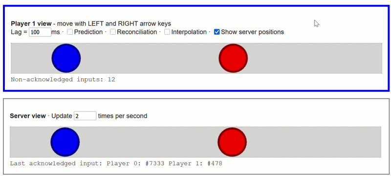
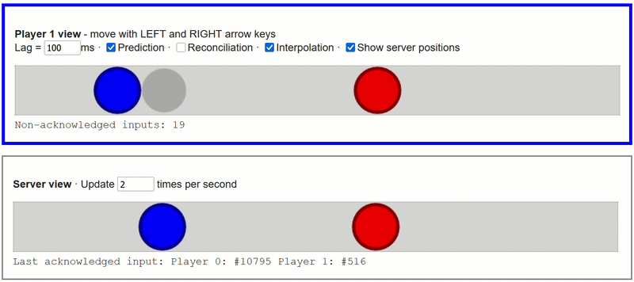
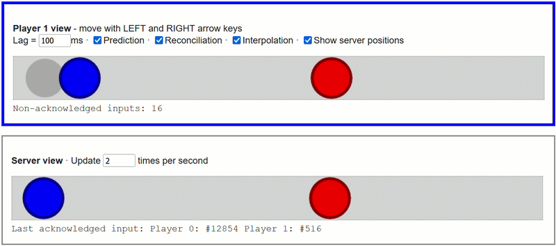
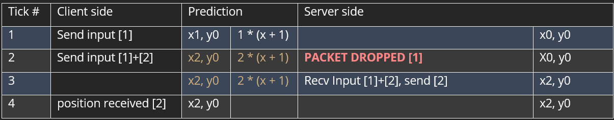
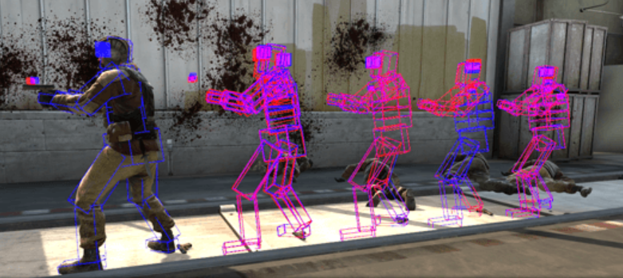

# Networking for an FPS by Jim Hamers  -  January 2026

### Introduction
This is a blogpost about online FPS games and their netcode to make the game fair and responsive. We will be diving into techniques to make the online experience feel responsive despite the network in between.
To learn about these topics I've made a basic FPS game in C++ with the networking library ENET and will expand on this topic with some pseudo-code from my frame of reference. This blogpost expects familiarity with online gaming specifically with the FPS genre, also some networking knowledge is helpful but not needed.
There will be minimal focus on cheating prevention nor bandwidth reduction.

### Jargon
- FPS, First Person Shooter the game genre.
- PoV, Point of View.
- Client, The player's perspective or machine.
- Server, Databroker and main simulator of the game.
- Packet, Information between server/client.
- Latency, Delay in MilliSeconds from server to client one way.
- Jitter, Time variance between packets arrival.
- Frame, One render update on the clients machine.
- Tick, One fixed step for networkside, running both on the server and client.
- Input, The clients intent for one tick, key presses, mouse movement

## Table of contents

1. Authoritative server
2. Clientside prediction
3. Server reconciliation
4. Poor network condition mitigation
5. Rollback hitscan
6. Conclusion

## 1. Authoritative server
An authoritative server will be the brain behind the game. When a client wants to move, it sends only an input (Left or Right movement for example). The server reads the input and moves the client corresponding to the input. The server sends back the new position of the client. The client receives the data and updates the location for the clients PoV.



Only having a 100ms latency, the client will perceive a very noticeable delay for their input. Considering the data has to travel both ways the lag/latency will be doubled for a complete round-trip.

### Why do we want an authoritative server?

If a nefarious player would be playing with a modified client for example and modifying their speed, The ground truth will be the same for client and server, because the client isn't doing the movement itself. The server is moving every player.
But it's not only beneficial against cheating, having a ground truth that everyone relies on helps synchronisation. If a player would somehow drop packets when they receive the latest packet from the server, they'd be on the same tick as everyone else.

But knowing why, doesn't mean it's worth the sacrifice. Surely we can do something about this input delay, and yes there is and that's clientside prediction.

## 2. Client side prediction

To improve on the authoritative server design, client prediction to the rescue.
Having any delay on your inputs doesn't play well, it will feel sluggish and detracts from the experience.
To combat this delay, we're going to predict/assume that the server will move us according to our input, so we move prematurely instead of waiting for the server to acknowledge and update our position. Now we've solved the input delay, but there will still be some hiccups depending on frame-rate and packet timings.



Every time we move another direction, because there is a mismatch in server ticks and our clients framerate we have hiccup every time we change direction.
Because the server is in control and updating the clients position, if there is any delay at all, there will always be a small hiccup.

Now we finish the puzzle with the final piece. Server reconciliation correcting our prediction when it drifts.

## 3. Server reconciliation

Server reconciliation is more than just updating my position whenever I receive an update from the server. It's also storing all the inputs we've sent to the server in a list with a #tick variable, so we know exactly what inputs the server has received, and which haven't. Whenever the client receives an updated version of their position, they can redo all the inputs that haven't been acknowledged resulting in the exact same position as before.

If that didn't make sense yet, if the client has 10 sent inputs, and receives an updated position with #tick3 as the last acknowledged input by the server, then we can redo the inputs 4-10 and arrive at the exact same location, barring any discrepancy because of other player interference. And now we scrap inputs 1-3 since the server has moved us accordingly for these processed ticks.



Following these examples is some pseudoish code that explains how this would look like.

```cpp
struct Inputs
{
    bool forward;
    bool left;
    int currentTick;
    ...
};

// Client remembers all their sent inputs in list
std::deque<Inputs> m_pendingInputs;

SendInputs()
{
    Inputs inputs;
    inputs.SetInputs(); // get all held inputs and store them

    //Store inputs
    m_pendingInputs.push_back(inputs);

    //Send the same inputs to the server
	send_packet(inputs);
}
```


```cpp
// Client

// Removing inputs we know the server has already computed
while (!m_pendingInputs.empty() &&
				m_pendingInputs.front().currentTick <= update.lastProcessedInput)
{
				m_pendingInputs.pop_front();
}

m_predictedPos = m_authoritativePos;

// Recalculate our new position from the authoritative start
for (auto& input : m_pendingInputs)
{
    // Passing value as reference, function will modify it and add the positional changes
	ProcessInput(input, &m_predictedPos);
}
```

It's imperative that the logic that the server uses to move your character is exactly the same as the logic the client will use to move your character for a truthful result.

```cpp
#include shared.hpp

struct NetworkPlayer
{
    float x, y;
    float speed = 3.f;
}

// Whatever the logic is for moving the player, it needs to be called by the client for the prediction and the server for the actual movement.
HandleInput(const Inputs& a_input, vec3& a_position)
{
     if (a_input.forward)
        a_position.x += player.speed;

    ...
}
```

As long as the same code is used by both server and client at the same fixed interval the positions should stay the same, barring any packet drops and or packet with wrong ordering, if there is a discrepancy the new authoritative position corrects our position in worldspace.

## 4. Poor network condition mitigation

### Latency
In the real world, the latency will fluctuate, the packets won't always reach their destination and also the order can be out of whack.
Our prediction was done to mitigate latency, depending on the size of our pending input buffer we can deal with any amount of latency fluctuation.

### Packet drops


In this scenario our client will predict we'll be at x2 from tick #2 and #3, but on tick #4 we'll notice that the latest and newest packet is actually only at x1, with our reconciliation we'll remove the older packets, and move back to our old position of tick #1.

This problem is actually fixed very easily, every packet we send, we send all of our pending inputs!

So in this newer situation:



Since packet [2] holds both inputs when the server receives packet 2 it can just compute both packets in 1 tick and update the position accordingly.

This does open up some vulnerability for cheating if the player sends more inputs per tick than it's allowed to do. Make sure the server tracks the latest tick it received from the client, and only processes one input per tick missed.

Since in this example the server hasn't received any data from the client for 2 or more ticks, it can safely compute 2 inputs in a single tick.

### Packets in the wrong order

Reject any packet that's older than the newest we've received, since we're already sending every old packet with any newer packet, we're never losing data as long as it fits in our input buffer.

```cpp
// Ignore if not newer
if (update.tick <= m_lastTick)
    continue;

// Packet is newer so handle accordingly
...

```

This packet rejection counts the same for both server and client, redundancy saves the day!

## 5. Rollback hitscan

This next part is where the FPS-netcode comes into play, before it's just generic inputs that apply to every game. Even though network rollback is applied in many different games, this will be about shooting.



Network rollback is for the server to go back in time, and review the footage with all the data that the client had at the time.

Knowing we're predicting so we're ahead of the server, but we're also waiting for the server to send updated positions of the enemy team which means the enemies we see are always a few ticks behind their real position on the server. Shooting at them is shooting at a ghost.


Anyone who has played an online shooter has experienced dying when you just duck behind a wall for cover, it might feel unfair to you, but on the other end the enemy shot you a couple ticks back where you weren't fully behind cover just yet. So either you don't get hit and the shooter has a bad experience or try to make the best of it. It's the price we have to pay.

The way to fix this discrepancy is rolling back to whatever tick the client shot the bullet, and then rollback to whatever positions all of the enemies are and using that data to check whether the player hit an enemy or not.
There will be some estimates, since the players tick might be at #10, but the last received update might be on tick #8 so we rollback all the enemies to #8 and the client at tick #10 and then we check whether this ray hits or misses the target.

Depending on how much of a buffer the server holds and how much latency there is between clients will have a huge impact on how long you can still be killed while just arriving behind cover.


## 6. Conclusion

Researching and working on networking for these past 8 weeks has been a blast, figuring out and researching about all the clever techniques implemented to make the game feel as responsive as possible yet fair on both sides is awesome.
I have a new-found respect for online games managing to keep every client in-sync.

In the future I'd love to tackle harder replication with prediction of compounding movement for example physics forces and smoothing the correction over time to make discrepancies less noticeable.

Also with an authoritative server you don't prevent cheating all together, there are many kinds of cheating like seeing through walls, aimbotting and more. Learning more about ways to prevent and detect cheating players is a big part in a successful online shooter game which I'll delve into more in the future.

### Sources:
https://www.gabrielgambetta.com/client-server-game-architecture.html
https://codersblock.org/multiplayer-fps/part1/
https://technology.riotgames.com/news/peeking-valorants-netcode
https://clutchround.com/csgo-netsettings-for-competitive-play/
